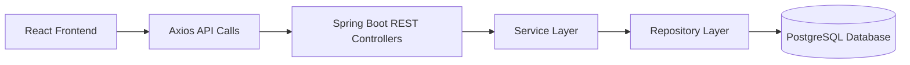

# 💰 Personal Finance Tracker

<div align="center">

A modern full-stack finance dashboard to track income, expenses, trends, CSV imports, and AI-style insights.


</div>

---

## 📌 Overview

Personal Finance Tracker is a full-stack web application built to help users manage and analyze personal finances through a clean and interactive dashboard.

The application supports:
- manual transaction entry
- CSV-based transaction import
- dashboard summaries
- category-based analytics
- monthly financial trend visualization
- AI-style financial insights

This project combines **Spring Boot REST APIs**, **React frontend development**, **PostgreSQL persistence**, and **data visualization** into one production-style application.

---

## ✨ Key Features

### Finance Management
- Add income and expense transactions manually
- View all saved transactions in a structured table
- Delete transactions
- Upload multiple transactions using CSV

### Dashboard Analytics
- Total income
- Total expenses
- Net balance
- Category-wise expense breakdown
- Monthly income vs expense trends

### Insights
- Spending pattern observations
- Highest spending category detection
- Income vs expense comparison
- Simple AI-style insight generation

### UI Experience
- Dashboard card layout
- Responsive page structure
- Interactive charts
- Styled form and upload section
- Clean tabular transaction display

---

## 🖼️ Screenshots

> Replace these image paths with your actual screenshots after adding them to the repository.

### Dashboard Overview


### Charts and Insights


### Transactions Table


---

## 🎬 Demo

> Add a GIF or screen recording later for a stronger GitHub presentation.

```md

```

---

## 🧱 Tech Stack

### Backend
- Java
- Spring Boot
- Spring Data JPA
- Hibernate
- PostgreSQL
- Apache Commons CSV

### Frontend
- React
- Vite
- Axios
- Recharts
- CSS

### Tools
- IntelliJ IDEA
- Postman
- pgAdmin / PostgreSQL
- Git / GitHub

---

## 🏗️ Architecture



---

## 📂 Project Structure

```text
Personal-Finance-Tracker/
│
├── backend/
│   ├── src/main/java/com/finance/backend/
│   │   ├── controller/
│   │   ├── dto/
│   │   ├── entity/
│   │   ├── repository/
│   │   └── service/
│   ├── src/main/resources/
│   │   └── application.properties
│   └── build.gradle
│
└── frontend/
    ├── src/
    │   ├── api/
    │   ├── components/
    │   ├── App.jsx
    │   ├── App.css
    │   └── index.css
    └── package.json
```

---

## 🧩 Functional Modules

### 1. Transaction Management
Users can add financial records manually using a transaction form.

### 2. CSV Upload
Users can bulk import data using a CSV file.

### 3. Dashboard Summary
The application calculates:
- total income
- total expense
- remaining balance

### 4. Data Visualization
The dashboard includes:
- category-wise expense breakdown
- month-wise income vs expense trend

### 5. Insights Engine
The system generates simple insights such as:
- whether income is higher than expenses
- highest spending category
- recurring expense categories

---

## 📊 Graphs Used

### Expense Breakdown by Category
- Implemented using **PieChart**
- Displays category-wise expense distribution
- Best for quick visual comparison of spending categories

### Monthly Income vs Expense Trend
- Implemented using **LineChart**
- Displays monthly movement of income and expense
- Helps identify trends and financial patterns over time

---

## 🎨 UI / Styling Highlights

- Card-based dashboard sections
- Clean spacing and alignment
- Responsive layout for wider screens
- Styled summary blocks with color emphasis
- Consistent input and button design
- Better visual separation between charts, table, and insights

---

## 🛠️ Setup Instructions

### 1. Clone the repository

```bash
git clone <your-repository-url>
cd Personal-Finance-Tracker
```

### 2. Database Setup

Create a PostgreSQL database:

```sql
CREATE DATABASE finance_tracker;
```

Update `backend/src/main/resources/application.properties`:

```properties
spring.application.name=backend

spring.datasource.url=jdbc:postgresql://localhost:5432/finance_tracker
spring.datasource.username=postgres
spring.datasource.password=YOUR_PASSWORD

spring.jpa.hibernate.ddl-auto=update
spring.jpa.show-sql=true
spring.jpa.properties.hibernate.format_sql=true

server.port=8080
```

### 3. Run Backend

From IntelliJ:
- Open the backend project
- Run `BackendApplication.java`

Or from terminal:

```bash
./gradlew bootRun
```

Backend runs on:

```text
http://localhost:8080
```

### 4. Run Frontend

Go to frontend folder:

```bash
cd frontend
npm install
npm run dev
```

Frontend runs on:

```text
http://localhost:5173
```

---

## 🔌 API Endpoints

### Transaction APIs

#### Create Transaction
```http
POST /api/transactions
```

#### Get All Transactions
```http
GET /api/transactions
```

#### Delete Transaction
```http
DELETE /api/transactions/{id}
```

#### Upload CSV
```http
POST /api/transactions/upload
```

### Dashboard APIs

#### Get Summary
```http
GET /api/dashboard/summary
```

#### Get Category Breakdown
```http
GET /api/dashboard/category-breakdown
```

#### Get Monthly Trend
```http
GET /api/dashboard/monthly-trend
```

#### Get Insights
```http
GET /api/dashboard/insights
```

---

## 🧪 Sample Request

### Create Transaction

```json
{
  "amount": 5000,
  "type": "INCOME",
  "category": "Salary",
  "description": "Monthly salary",
  "transactionDate": "2026-04-20",
  "source": "MANUAL"
}
```

---

## 📄 Sample CSV Format

```csv
amount,type,category,description,transactionDate,source
5000,INCOME,Salary,Monthly salary,2026-04-20,CSV
200,EXPENSE,Food,Lunch,2026-04-20,CSV
100,EXPENSE,Transport,Bus pass,2026-04-20,CSV
```

---

## 🌟 Current Project Status

This version currently includes:
- full backend and frontend integration
- PostgreSQL persistence
- dashboard analytics
- CSV upload
- manual transaction entry
- charts and insights
- modernized UI structure

---

## 🔮 Future Enhancements

- Edit transaction
- Filter/search transactions
- Budget goal tracking
- Authentication and user-specific dashboards
- Export reports as CSV/PDF
- Category normalization for old records
- Smarter insight generation
- Animated charts and richer dashboard widgets
- Dark mode support

---

## 🧠 Learning Outcomes

This project demonstrates practical knowledge of:
- Spring Boot REST API development
- React frontend integration
- PostgreSQL setup and connectivity
- DTO / Entity / Repository / Service architecture
- CSV file handling
- chart integration using Recharts
- dashboard design and UI cleanup
- debugging full-stack application issues

---

## 📈 Resume-Ready Project Summary

Built a full-stack Personal Finance Tracker using **Spring Boot, React, PostgreSQL, and Recharts** to manage transactions, upload CSV data, generate dashboard summaries, visualize spending trends, and provide AI-style financial insights through a responsive web interface.

---

## 👤 Author

Developed as a full-stack finance dashboard project using Java Spring Boot, React, PostgreSQL, and modern frontend visualization tools.

---

## 💡 Optional Add-ons for GitHub

You can further improve this README by adding:
- real screenshots
- a demo GIF
- deployment link
- architecture diagram image
- badges for commits/issues/license
- animated preview banner
